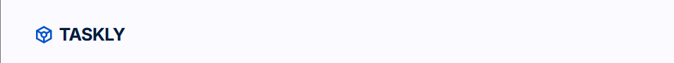
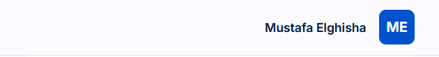
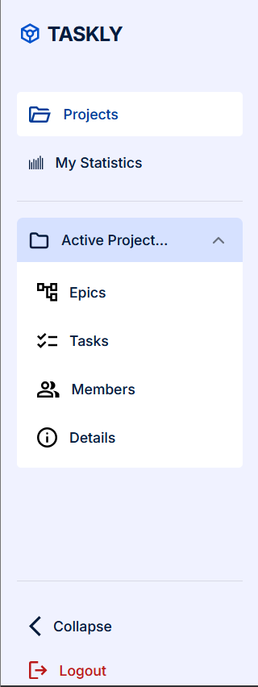
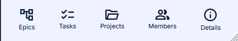
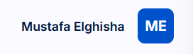
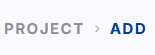

# Shared Components

## Overview

This document lists the UI components identified as suitable for reuse after reviewing the existing Taskly screens.

The review covers the current application screens and shared layouts, including:

- Login
- Sign Up
- Projects
- Add New Project
- Projects loading state
- Projects error state

Components are considered shared when they are used across multiple screens or provide a common UI pattern that is intentionally reused with different variants or content.

---

## Shared Components

| #   | Component        | Description                                                                                 | Used In                                                         | Screenshot                                                         |
| --- | ---------------- | ------------------------------------------------------------------------------------------- | --------------------------------------------------------------- | ------------------------------------------------------------------ |
| 1   | Logo             | Taskly brand/logo used in application navigation and authentication                         | Login, Sign Up, Projects, Add New Project, Project Epics        |              |
| 2   | AuthHeader       | Authentication header containing the Taskly logo                                            | Login, Sign Up                                                  |        |
| 3   | MainHeader       | Authenticated application header containing mobile navigation controls and user information | Projects, Add New Project, Project Epics                        |        |
| 4   | MainSidebar      | Primary desktop navigation for the authenticated application                                | Projects, Add New Project, Project Epics                        |       |
| 5   | MobileNavigation | Bottom navigation used on small screens                                                     | Projects, Add New Project, Project Epics                        |  |
| 6   | UserInfo         | Displays the authenticated user's name, job title, and avatar initials                      | Projects, Add New Project, Project Epics                        |          |
| 7   | MainBreadCrumb   | Route BreadCrumb navigation for nested authenticated pages                                  | Add New Project, Project Epics                                  |    |
| 8   | Button           | Reusable action button with multiple visual variants                                        | Login, Sign Up, Projects, Add New Project, Projects error state |            |
| 9   | Input            | Reusable text and checkbox input field                                                      | Login, Sign Up, Add New Project                                 |             |
| 10  | Field            | Reusable form field structure for labels, descriptions, and validation errors               | Login, Sign Up, Add New Project                                 |             |
| 11  | Separator        | Visual divider used to separate sections of the interface                                   | MainHeader, MainSidebar, Add New Project                        |         |

---

## Component Details

### 1. Logo

**Purpose:**  
Provides the Taskly brand identity in places where application branding is required.

**Used in:**

- Authentication header on Login and Sign Up
- Desktop sidebar on authenticated pages

**Why reusable:**  
The same brand mark is used in both authentication and application navigation. The component also supports the sidebar's collapsed state.

**Component:** `src/components/Logo.tsx`

---

### 2. AuthHeader

**Purpose:**  
Provides a consistent header for authentication screens.

**Used in:**

- `/login`
- `/sign-up`

**Why reusable:**  
Both authentication screens share the same top-level branding and header layout.

**Component:** `src/app/(auth)/_components/AuthHeader.tsx`

---

### 3. MainHeader

**Purpose:**  
Provides the top header for authenticated pages. It contains the mobile navigation trigger and the authenticated user's information.

**Used in:**

- `/project`
- `/project/add`
- `/project/[projectId]/epics`

**Why reusable:**  
The header is part of the authenticated application shell rather than being specific to one page.

**Component:** `src/app/(dashboard)/_components/MainHeader.tsx`

**Variants / behavior:**

- Desktop: displays user information on the right.
- Mobile: displays the navigation menu trigger and Taskly branding.

---

### 4. MainSidebar

**Purpose:**  
Provides primary navigation for the authenticated desktop application.

**Used in:**

- Projects
- Add New Project
- Project Epics

**Why reusable:**  
Navigation remains consistent throughout the authenticated area. The sidebar also supports collapsed and expanded states and contains the active-project navigation.

**Component:** `src/app/(dashboard)/_components/MainSidebar.tsx`

**Variants / behavior:**

- Expanded desktop sidebar
- Collapsed desktop sidebar
- Mobile drawer

---

### 5. MobileNavigation

**Purpose:**  
Provides bottom navigation for authenticated users on small screens.

**Used in:**

- Projects
- Add New Project
- Project Epics

**Why reusable:**  
It belongs to the authenticated application shell and is displayed consistently across dashboard screens.

**Component:** `src/app/(dashboard)/_components/MobileNavigation.tsx`

**Variants / behavior:**

- Active navigation item
- Inactive navigation item

---

### 6. UserInfo

**Purpose:**  
Displays the current user's identity, including their name, optional job title, and avatar initials.

**Used in:**

- Projects
- Add New Project
- Project Epics

**Why reusable:**  
User identity information is part of the shared authenticated header and can be reused anywhere the current user's information needs to be displayed.

**Component:** `src/app/(dashboard)/_components/UserInfo.tsx`

**Variants / behavior:**

- Desktop: name, job title, and avatar
- Mobile: avatar only

---

### 7. MainBreadCrumb

**Purpose:**  
Displays the current route hierarchy for nested authenticated pages.

**Used in:**

- Add New Project
- Project Epics

**Why reusable:**  
The component derives its items from the current pathname, allowing it to work across different nested routes without page-specific breadcrumb markup.

**Component:** `src/app/(dashboard)/_components/MainBreadCrumb.tsx`

**Note:**  
The breadcrumb is hidden on the main `/project` screen because there is no nested route hierarchy to display.

---

### 8. Button

**Purpose:**  
Provides the application's reusable action button styles and behavior.

**Used in:**

- Login
- Sign Up
- Add New Project
- Projects error state
- Project-related actions

**Why reusable:**  
Buttons appear throughout the application and use consistent styling while supporting different semantic purposes.

**Component:** `src/components/ui/Button.tsx`

**Variants / examples:**

- Primary action
- Secondary action
- Ghost action
- Loading/disabled state

Examples include:

- `Log In`
- `Sign Up`
- `Create Account`
- `Create Project`
- `Back`
- `Retry Connection`

---

### 9. Input

**Purpose:**  
Provides the base input control used for collecting user and project information.

**Used in:**

- Login
- Sign Up
- Add New Project

**Why reusable:**  
The same input behavior and visual treatment is used for multiple form fields throughout the application.

**Component:** `src/components/ui/Input.tsx`

**Variants / examples:**

- Text input
- Email input
- Password input through `PasswordInput`
- Checkbox

---

### 10. Field

**Purpose:**  
Provides the common structure around form controls, including labels, descriptions, and validation messages.

**Used in:**

- Login
- Sign Up
- Add New Project

**Why reusable:**  
All application forms follow the same field structure and validation presentation.

**Component:** `src/components/ui/Field.tsx`

**Related elements:**

- `FieldLabel`
- `FieldDescription`
- `FieldError`

---

### 11. Separator

**Purpose:**  
Provides a visual divider between related sections of the interface.

**Used in:**

- MainHeader
- MainSidebar
- Add New Project form

**Why reusable:**  
The same divider pattern is used in different parts of the application to establish visual separation.

**Component:** `src/components/ui/Separator.tsx`

---
